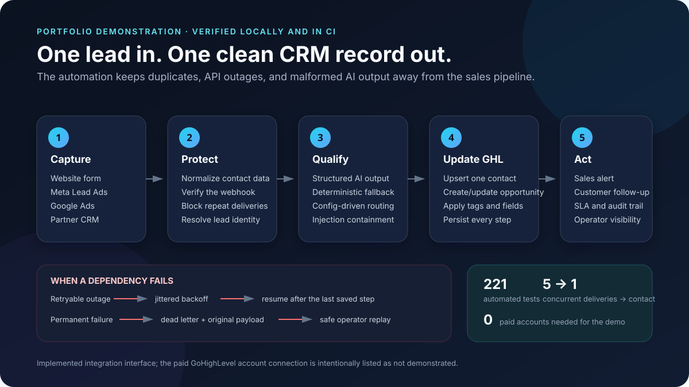

# Case study: resilient lead intake for GoHighLevel

> A portfolio demonstration of the deliverable I can build for an agency or service business. It was not commissioned by a client and has not processed production leads.

## The business problem

Lead automation looks simple when every system is healthy: receive a form, create a contact, and send a message. The expensive failures happen outside that happy path:

- ad platforms redeliver the same webhook and create duplicate contacts;
- one person submits through multiple sources and receives competing follow-ups;
- the CRM saves the contact but fails before the opportunity is created;
- a temporary API outage drops a lead or triggers an unsafe full retry;
- an LLM returns malformed output or follows instructions embedded in a lead message;
- nobody can explain which rule routed a lead after the fact.

This project treats those behaviours as the main requirements, not edge cases.

## What I built

| Deliverable | What it provides |
|---|---|
| Two importable n8n workflows | Multi-source webhook intake, visible routing, retries, error handling, and audit output |
| FastAPI lead-operations service | Normalization, signature verification, idempotency, qualification, routing, and replay APIs |
| GoHighLevel v2 integration layer | Contacts, opportunities, tags, custom fields, notes, conversations, and appointments |
| Configuration-first onboarding | Account-specific field, pipeline, stage, routing, and SLA mappings stay outside application code |
| Fault-injecting GHL mock | Repeatable 429, 5xx, timeout, authentication, validation, and partial-failure scenarios |
| Handover documentation | Architecture decisions, deployment steps, security boundaries, limitations, and a live-account checklist |

The architecture deliberately keeps orchestration visible in n8n while moving correctness-critical rules into a versioned service that can be tested under concurrency and failure.

## Demonstrated outcomes

These are engineering outcomes demonstrated by the repository, not production business metrics:

- **Five concurrent deliveries create exactly one CRM contact.** A database uniqueness constraint decides the winner instead of a vulnerable check-then-create sequence.
- **A partial retry resumes instead of restarting.** If the contact succeeds and the opportunity fails, the next delivery reuses the completed contact step.
- **One person stays one person across lead sources.** Delivery identity and contact identity use separate keys because they answer different questions.
- **Temporary failures recover without losing the lead.** Retryable responses use jittered backoff and respect `Retry-After`.
- **Permanent failures remain recoverable.** The original payload enters a dead-letter queue and can be replayed under the original idempotency key.
- **AI degradation is visible and bounded.** Invalid output, timeouts, and provider failures fall back to deterministic qualification; deterministic code makes the routing decision.
- **Customer-facing actions happen last.** A failure cannot send a success message for a lead that never reached the CRM pipeline.

## Evidence a reviewer can inspect

| Evidence | Direct link |
|---|---|
| Run eight success and failure scenarios without credentials | [`python scripts/demo.py`](docs/demo.md#1-the-scripted-demo) |
| Inspect the complete captured request/response trace | [`examples/`](examples/) |
| Review the n8n flow node by node | [`docs/n8n-workflow.md`](docs/n8n-workflow.md) |
| Inspect the generated workflow files | [`n8n/workflows/`](n8n/workflows/) |
| Review GHL request/response shapes and onboarding checks | [`docs/ghl-integration.md`](docs/ghl-integration.md) |
| Review security boundaries and tested attacks | [`docs/security.md`](docs/security.md) |
| Review known limitations | [`docs/limitations.md`](docs/limitations.md) |
| Inspect all automated checks | [GitHub Actions](https://github.com/yuten0901/ghl-n8n-lead-automation/actions/workflows/ci.yml) |

The suite contains **221 automated tests**. CI runs it on Python 3.11, 3.12, and 3.13, runs it again on PostgreSQL, executes the complete demo, regenerates and checks the n8n workflow, and verifies that the secret scanner rejects a planted credential.

## What a client handover would include

For a real engagement, I would adapt the same delivery structure to the client's account:

1. map the actual lead sources, payloads, duplicate rules, pipeline stages, and SLA ownership;
2. configure the client's GHL location using read-only discovery before enabling writes;
3. connect credentials in the deployment environment rather than exporting them with n8n;
4. validate contact matching, opportunity search, custom fields, rate limits, and internal notifications on a test lead;
5. run acceptance scenarios for duplicate delivery, partial failure, vendor outage, replay, and degraded AI;
6. hand over workflow files, source, configuration, deployment instructions, tests, and an operator runbook.

The service layer is appropriate when a lead is valuable, more than one source is involved, or retries must be provably safe. For a simple form-to-contact flow, I would recommend a smaller pure-n8n build instead.

## Verification boundary

The distinction matters:

- the ingestion, normalization, idempotency, routing, retry, dead-letter, replay, and local CRM interactions are implemented and tested;
- the n8n workflow files were imported into n8n 2.36.8 and are structurally checked in CI;
- the GHL client is implemented against the documented API v2 surface and exercised against the bundled fault-injecting mock;
- **a paid GoHighLevel sub-account connection is not demonstrated**;
- **the workflow has not been executed end to end inside n8n with real credentials**;
- **live Anthropic and OpenAI calls are not claimed**; provider request and response handling use stubbed transports in tests.

Those live-account checks belong in the first controlled stage of a client engagement, using the checklist in [`docs/ghl-integration.md`](docs/ghl-integration.md#first-contact-with-a-real-account).
