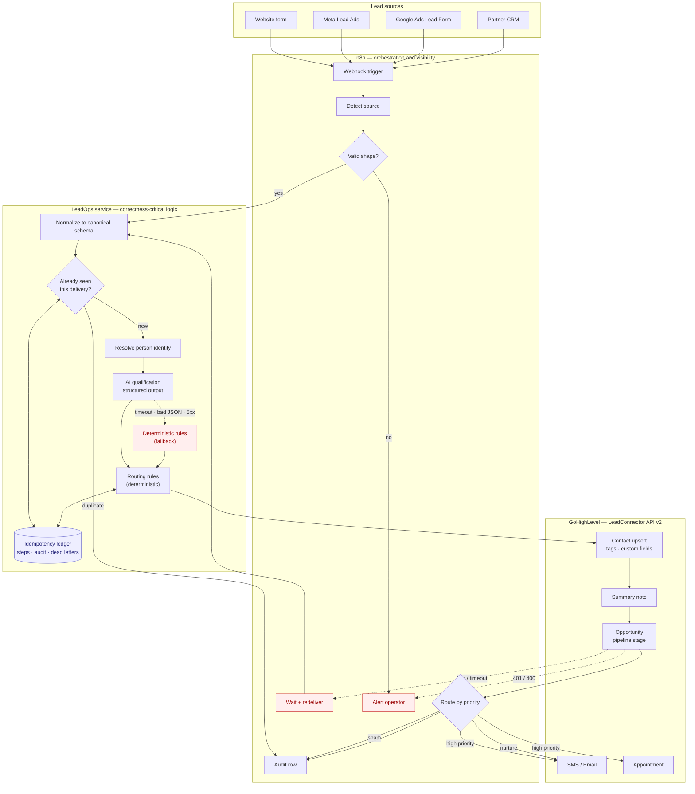

# GoHighLevel + n8n + AI Lead Automation

**Inbound leads from four sources land in GoHighLevel as one clean contact, scored and routed, within seconds — without duplicates, and without losing leads when an API is down.**


A production-style lead-operations system for a home-services business: a website form, Meta Lead Ads, Google Ads Lead Forms and a partner CRM all post to one webhook. Each lead is normalized, deduplicated, qualified by an LLM with a deterministic fallback, then written to GoHighLevel as a contact + opportunity with tags, custom fields and a pipeline stage — and routed to an SMS callback, a nurture sequence, or nowhere at all if it is spam.

**Run the whole thing in 30 seconds, with no accounts and no credentials:**

```bash
pip install -e ".[dev]"
python scripts/demo.py
```

---

## The problem this solves

Agencies running GoHighLevel hit the same four failures. Each one is handled here, and each has a test that proves it:

| Failure | What it costs | Where it is handled |
|---|---|---|
| The same webhook is delivered twice | Duplicate contacts, duplicate pipeline cards, a customer texted twice | [`idempotency/keys.py`](src/leadops/idempotency/keys.py) · [test](tests/integration/test_pipeline.py) |
| One person fills two different forms | Two contacts, split history, two salespeople calling | `lead_identity_key` + GHL upsert · [test](tests/integration/test_pipeline.py) |
| The CRM API is down for 90 seconds | Leads silently dropped, no record they existed | Retry + backoff, dead letters, replay · [test](tests/integration/test_pipeline.py) |
| The contact saves but the opportunity fails | A retry creates a *second* contact | Per-step memoization · [test](tests/integration/test_pipeline.py) |

---

## Architecture



**The one design decision worth explaining.** n8n orchestrates and makes the flow visible; the correctness-critical logic — idempotency, normalization, LLM output validation, GHL write semantics — lives in a versioned, unit-tested service that n8n calls over HTTP.

Pure-n8n is faster to build and is the right answer for a simple flow. It is the wrong answer here, because the parts that must be *right* are the parts that are hardest to test and review inside a workflow UI: a race between two simultaneous deliveries, a retry that must resume rather than restart, a model that returns prose instead of JSON. Those are 218 automated tests in this repository. [`docs/architecture.md`](docs/architecture.md#why-not-pure-n8n) sets out the trade-off, including when I would *not* choose this split.

---

## What is real, and what is mocked

Stated up front, because it is the first thing a technical client should want to know.

| | Status |
|---|---|
| Lead ingestion, normalization, idempotency, routing, retries, dead letters, replay | **Real.** Fully implemented and tested. |
| AI qualification with structured output, schema repair, deterministic fallback | **Real.** Runs offline by default; Anthropic and OpenAI clients are implemented and configuration-selected. |
| GoHighLevel API v2 client — contacts, opportunities, tags, custom fields, notes, conversations, appointments | **Implemented integration interface**, written against the documented v2 API and exercised end-to-end against a local mock. |
| A live connection to a paid GoHighLevel sub-account | **Not demonstrated.** No paid GHL location was available. [`docs/ghl-integration.md`](docs/ghl-integration.md#first-contact-with-a-real-account) lists exactly what to re-verify on first contact with one. |
| n8n workflow JSON | **Importable and structurally validated in CI** (20 nodes, connection graph, no embedded credentials). **Not yet run inside n8n** - neither by CI nor by hand. The logic the nodes coordinate lives in the service and is tested there. |
| Live Anthropic / OpenAI calls | **Not executed.** Request construction and response handling are tested through a stubbed transport. |

No screenshots of a GoHighLevel account appear in this repository, because I do not have one to screenshot. The exact request and response bodies are in [`docs/ghl-integration.md`](docs/ghl-integration.md) instead.

---

## Try it

### 1. The full demo — no accounts, no Docker, no network

```bash
python -m venv .venv && .venv/bin/pip install -e ".[dev]"    # Windows: .venv\Scripts\pip
python scripts/demo.py
```

Eight scenarios run against the bundled GoHighLevel mock and print what ended up in the CRM: an emergency lead, four duplicate redeliveries, the same person arriving from two ad platforms, an uncontactable lead, spam, a prompt-injection attempt, a transient 500 that recovers, and a partial failure that resumes. Every one is also an automated test.

### 2. Over HTTP, the way n8n calls it

```bash
python scripts/run_mock_ghl.py &                      # mock GoHighLevel on :8081
uvicorn leadops.api.main:app --port 8000 &            # the service on :8000
python scripts/send_lead.py website-lead-emergency.json
python scripts/send_lead.py meta-lead-ads.json --times 3     # duplicate delivery
```

### 3. In n8n

Import [`n8n/workflows/01-lead-intake.json`](n8n/workflows/01-lead-intake.json) and [`02-error-handler.json`](n8n/workflows/02-error-handler.json), set `LEADOPS_BASE_URL`, and POST a fixture to the webhook. [`docs/n8n-workflow.md`](docs/n8n-workflow.md) walks through each node.

---

## Example: one lead, end to end

**In** — a website form post:

```json
{
  "submission_id": "ws_2026082901",
  "name": "Dana Whitfield",
  "email": "Dana.Whitfield@example.com ",
  "phone": "(512) 555-0147",
  "service": "Heating repair",
  "message": "Our furnace stopped working overnight and there is no heat in the house. We have a baby at home so this is urgent - can someone come out today?",
  "city": "Round Rock, TX",
  "submitted_at": "2026-08-29T07:14:22Z"
}
```

**AI qualification** — validated against a JSON schema, clamped, and coerced into a closed vocabulary before anything acts on it:

```json
{
  "intent": "Urgent repair needed",
  "service_category": "emergency_repair",
  "priority": "high",
  "qualification_score": 90,
  "missing_information": [],
  "summary": "Dana Whitfield enquired about emergency repair in Round Rock, TX (service field: Heating repair).",
  "recommended_action": "Call within the SLA window.",
  "degraded": false,
  "provider": "deterministic",
  "model": "rules-v1"
}
```

**CRM write** — `POST /contacts/upsert`, with the email lowercased and the phone in E.164 so GoHighLevel's own duplicate matching works:

```json
{
  "locationId": "loc_DEMO0000000000000000",
  "firstName": "Dana", "lastName": "Whitfield",
  "email": "dana.whitfield@example.com",
  "phone": "+15125550147",
  "city": "Round Rock, TX",
  "source": "leadops:website",
  "tags": ["leadops", "source-website", "priority-high", "emergency", "call-now"],
  "customFields": [
    { "id": "cf_DEMO_lead_score_000", "field_value": "90" },
    { "id": "cf_DEMO_lead_priority_", "field_value": "high" },
    { "id": "cf_DEMO_service_cat_00", "field_value": "emergency_repair" },
    { "id": "cf_DEMO_qual_mode_0000", "field_value": "deterministic" }
  ]
}
```

**Routing decision** — deterministic, config-driven, and carrying the reason it fired:

```json
{
  "rule_id": "emergency_high_priority",
  "pipeline_stage": "hot_lead",
  "monetary_value": 1200,
  "follow_up_sequence": "emergency_sms_then_call",
  "notify_sales": true,
  "sla_minutes": 5,
  "reason": "Emergency work is time-priced; a five-minute callback wins the job."
}
```

Those bodies are **excerpted from a real capture**, not invented: [`examples/`](examples/) holds the full, unedited request/response trace for this exact lead, recorded at the transport layer by [`scripts/capture_examples.py`](scripts/capture_examples.py). The excerpts above drop fields and reorder keys for readability; the files do not.

Then, in this order: a summary note on the contact, an opportunity in the `hot_lead` stage, an SMS to the customer, and an internal alert to sales. Side effects that reach the customer go last on purpose, so a failure never texts someone about a job the CRM has no record of.

---

## Reliability

The part a client is actually buying.

- **Two idempotency keys, not one.** *"Have I processed this delivery?"* and *"is this the same person?"* are different questions with different answers. Conflating them is the usual bug — [`idempotency/keys.py`](src/leadops/idempotency/keys.py).
- **Insert-first concurrency control.** A `UNIQUE` constraint decides the winner between simultaneous deliveries of the same event - not a check-then-act read. A test fires five concurrent deliveries and asserts exactly one contact. (`ensure_opportunity` does still search-then-create against GoHighLevel, which has no equivalent constraint to lean on; the residual race is described in [limitations](docs/limitations.md#known-weak-spots).)
- **Per-step memoization.** Completed steps are persisted, so a retry after a partial failure *resumes* instead of restarting. This is what stops the second contact.
- **Retry only what is retryable.** 429/5xx/timeouts retry with full-jitter backoff and honour `Retry-After`. A 400 or 401 goes straight to the dead-letter queue, because retrying it four times just fails four times and delays the alert.
- **Honest status codes.** `200` processed · `202` retryable, please redeliver · `400` your payload · `401` bad signature · `422` dead-lettered, a human must look. Returning `200` for everything is the most common webhook mistake.
- **The LLM cannot take the system down.** `qualify()` never raises. Timeout, 5xx, prose instead of JSON, a score of 250, an invented category — all end in a deterministic result flagged `degraded=true`, tagged in the CRM, and counted.
- **Dead letters are replayable.** `POST /admin/dead-letters/{id}/replay` re-runs from the stored payload under the original idempotency key, so it resumes at the failed step.
- **Ordering that fails safely.** Side effects that reach the customer go last, on purpose.

## Security

- No secrets in source, in the n8n workflow JSON, or in `.env.example`. CI runs a secret scanner **and asserts that the scanner detects a planted key** — a scanner that can only pass is decorative.
- **Webhook signatures**: HMAC-SHA256 over `{timestamp}.{raw body}`, constant-time compared, with a replay window. Verified against raw bytes, never a re-serialised body.
- With no secret configured the service reports `signature_verified: false` rather than claiming a verification it did not perform, and `/admin/stats` counts unverified requests.
- **PII stays out of logs.** Emails and phone numbers are masked in every log field. The LLM receives presence booleans (`has_phone: true`), never the customer's contact details.
- **Prompt injection is contained, and the limits are stated.** The model classifies; deterministic rules route, so the model cannot name a stage or an assignee. On top of that, instruction-shaped lead bodies are detected before any provider is called, on every path — tested with a model that *complies* with the injection. What that does and does not guarantee is spelled out in [ai-qualification.md](docs/ai-qualification.md#what-is-actually-guaranteed).

Details in [`docs/security.md`](docs/security.md).

---

## Testing

```bash
pytest -q          # 218 tests, ~11 seconds, no network
ruff check . && ruff format --check .
python scripts/scan_secrets.py
```

Integration tests run the real pipeline against the real mock GoHighLevel server, wired in-process. Nothing in `leadops` is stubbed — only the vendor is replaced — and the assertions are on resulting CRM state, which is the question a client actually asks.

| Area | Covers |
|---|---|
| Normalization | Five phone formats collapsing to one E.164 value; all four source shapes; unmapped fields preserved |
| Idempotency | Key derivation precedence; duplicate delivery; **five concurrent deliveries → one contact**; returning lead → one contact, one opportunity |
| AI | Malformed JSON, schema repair, out-of-range scores, hallucinated categories, provider timeouts, PII exclusion from prompts |
| Reliability | Transient 500 recovery, `Retry-After`, exhausted retries, permanent rejection → dead letter, **partial failure → resume not restart** |
| API | Status-code contract, signature verification, replay, admin views |
| n8n | Connection graph integrity, orphan nodes, embedded credentials, generator/committed-file drift |

CI runs the suite on Python 3.11/3.12/3.13, **again on PostgreSQL**, runs `scripts/demo.py` end to end (so the README's instructions cannot silently rot), and regenerates the n8n workflow to check it has not drifted.

---

## Repository layout

```
src/leadops/
  normalize/     four source adapters -> one canonical lead schema
  idempotency/   event key vs person key; step keys
  storage/       async SQLAlchemy: ledger, leads, audit, steps, dead letters
  ai/            provider abstraction, schema, validation/repair, rules fallback
  ghl/           LeadConnector v2 client, id mapping, CRM write ordering
  routing/       deterministic rules engine
  api/           webhook + admin routes, HMAC verification
  pipeline.py    the orchestrator
mock/ghl_mock/   local GoHighLevel v2 with scripted fault injection
n8n/workflows/   importable workflow JSON (main + error handler)
n8n/fixtures/    realistic payloads for every source and failure case
config/          routing.yml, ghl-mapping.json  (business rules as data)
docs/            architecture, GHL integration, n8n, security, demo, Upwork usage
scripts/         demo, mock server, lead sender, GHL id discovery, secret scan
```

## Documentation

| | |
|---|---|
| [architecture.md](docs/architecture.md) | The design decisions and their trade-offs, including what I would do differently at 100× the volume |
| [ghl-integration.md](docs/ghl-integration.md) | Every GHL request/response shape used, OAuth, rate limits, and what to verify on a real account |
| [n8n-workflow.md](docs/n8n-workflow.md) | Node-by-node walkthrough and import instructions |
| [ai-qualification.md](docs/ai-qualification.md) | Prompt, schema, failure handling, injection defence |
| [security.md](docs/security.md) | Secrets, signatures, PII, least privilege |
| [demo.md](docs/demo.md) | Every runnable command, with expected output |
| [limitations.md](docs/limitations.md) | What this does not do, and what production would need |
| [examples/](examples/) | Real captured request/response traces for one lead, end to end |
| [upwork-usage.md](docs/upwork-usage.md) | How I describe this work in proposals — including what I will not claim |

---

## Limitations

Short version — the full list is in [`docs/limitations.md`](docs/limitations.md):

- Not connected to a live GoHighLevel account (see the *real vs mocked* table above).
- Retries are driven by webhook redelivery plus an n8n wait node. A high-volume deployment wants a real queue; the dead-letter table and step memoization are already the hard part of that migration.
- SQLite is the default for reviewability. Postgres is a URL change and is covered by CI, and is required for more than one worker.
- Follow-up message copy is illustrative. Real campaign content belongs in GHL workflows, which is where the client's marketer can edit it.
- English-language keyword rules in the deterministic fallback.

## License

MIT — see [LICENSE](LICENSE).
