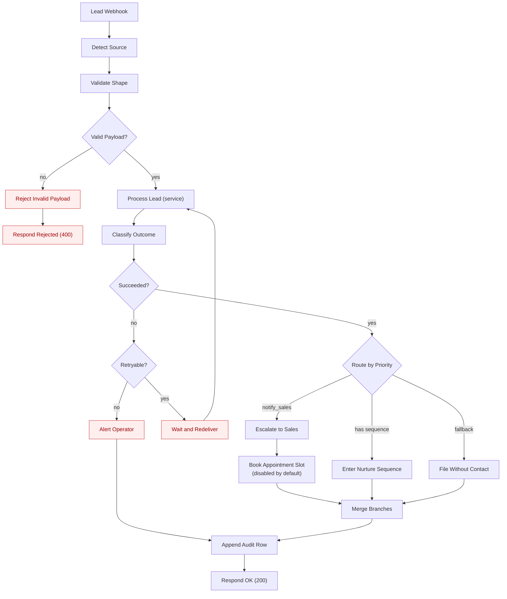

# The n8n workflows

Two files in [`n8n/workflows/`](../n8n/workflows/):

| File | Nodes | Purpose |
|---|---|---|
| `01-lead-intake.json` | 20 | Ingestion, service call, routing, retry, audit, response |
| `02-error-handler.json` | 6 | Set as the main workflow's `errorWorkflow`; catches what the main workflow cannot |

Both ship **inactive** and with no credential values. Importing a portfolio workflow should never start processing traffic.

---

## Import

Either the UI or the CLI works:

```bash
# imports both files; safe to repeat - the ids are fixed, so this updates
# rather than duplicating
n8n import:workflow --separate --input=n8n/workflows
```

Verified on **n8n 2.36.8** (2026-08-30): both workflows import into a clean
instance, and a second run leaves two workflows rather than four.

> ⚠️ Two things this exposed, worth knowing if you build your own export.
> `n8n import:workflow` writes straight into `workflow_entity`, whose `id` is
> `NOT NULL` and is **not** generated for you — a workflow JSON without a
> top-level `id` cannot be imported by the CLI at all. And tags need explicit
> ids, not just names: `tag_entity.name` is `UNIQUE`, so importing a directory
> of workflows that share a tag name fails partway through, leaving some
> imported and some not. Both files here carry fixed ids for that reason.
>
> If the target instance already has a tag named `gohighlevel` or
> `lead-automation` with a *different* id, the CLI import will still collide.
> That case was not reproduced here; the UI import path is unaffected.

Or through the UI:

1. n8n → **Workflows** → **Import from File** → `01-lead-intake.json`, then `02-error-handler.json`.
2. Set two environment variables on the n8n instance:
   ```
   LEADOPS_BASE_URL=http://127.0.0.1:8000     # or http://service:8000 under Compose
   GHL_LOCATION_ID=loc_...
   GHL_CALENDAR_ID=cal_...                    # only if you enable the appointment node
   ```
3. Create a **Header Auth** credential named `LeadOps service token` and attach it to **Process Lead (service)**, replacing the `REPLACE_WITH_YOUR_CREDENTIAL_ID` placeholder.
4. Open `01-lead-intake` → **Settings** → **Error Workflow** → select `Lead Ops - error handler`.
5. Send a fixture to the webhook:
   ```bash
   curl -X POST http://localhost:5678/webhook-test/lead-intake \
     -H "Content-Type: application/json" \
     -d @n8n/fixtures/website-lead-emergency.json
   ```

**Book Appointment Slot ships disabled**, because it is the one node that needs a real, paid GoHighLevel location. Everything else runs against the local mock. Enable it once `GHL_CALENDAR_ID` and the GoHighLevel credential are set.

---

## Flow



---

## Node by node

### Ingestion

**Lead Webhook** — one POST path, `rawBody` on, `responseMode: responseNode` so the final response is explicit rather than implicit.

**Detect Source** — resolves `website | meta | google | partner` from a query parameter, an `X-Lead-Source` header, or the shape of the body (`leadgen_id` → Meta, `user_column_data` → Google). **One webhook URL for every source** is far easier to hand a client than four, and it means adding a source does not mean adding a webhook.

It also mints the **correlation id** — passed to the service, forwarded to GoHighLevel, and logged here, so one search spans all three systems — and picks the **idempotency key**, preferring a real delivery id from the sender over anything we invent.

**Validate Shape / Valid Payload?** — cheap structural checks (known source, JSON object, size bound). These would fail in the service too; catching them here keeps the reason visible in the n8n execution list, which is where the client looks.

### The service call

**Process Lead (service)** — POSTs the raw payload with the correlation and idempotency headers.

Two settings are load-bearing:

- **`neverError: true`** — without it, a 202 (retryable) and a 400 (permanent) both become the same n8n exception, and the branch that tells them apart never runs. We want the status code, not a thrown error.
- **`fullResponse: true`** — so `Classify Outcome` can read `statusCode` rather than guessing from the body.

`retryOnFail` with 3 tries covers transport blips before the workflow-level retry branch gets involved.

**Classify Outcome** — flattens the response into `outcome`, `retryable`, `routing`, `qualification`. It deliberately does not re-derive any decision the service already made: two implementations of one rule always drift.

### Routing

**Route by Priority** — a three-way switch on the service's routing decision: escalate (`notify_sales`), nurture (has a `follow_up_sequence`), or file only (fallback output).

The customer-facing side effects — the SMS, the email, the internal alert — were already performed by the service, in an order chosen so a partial failure never texts a customer about a job the CRM has no record of. These branches exist for what n8n is genuinely better at: making the SLA clock, the sequence hand-off, and the spam volume **visible to the person who owns the business**.

**Merge Branches** — three inputs into one, so the audit row and the response have a single path.

### Failure handling

**Retryable?** → **Wait and Redeliver** (5 minutes) → back into the service call.

Looping back is safe **only because the idempotency key is unchanged**. Completed steps are memoized, so the retry resumes at the failed step rather than re-creating the contact. A workflow that regenerated its key here would create a duplicate contact on every retry — this is the most common way a "retry" makes things worse.

**Alert Operator** — terminal failures. The service has already dead-lettered the event with its original payload, so this is a notification, not data recovery. It carries the replay URL.

### Audit and response

**Append Audit Row** — timestamp, execution id, correlation id, outcome, rule id, score, and whether the AI was degraded. The service holds the authoritative record; this exists so the client sees outcomes in the tool they already open, and so an execution is self-describing months later. Point it at Sheets, Airtable or a database node as the client prefers.

**Respond OK (200)** / **Respond Rejected (400)** — explicit, so the sender's retry behaviour is something we chose.

---

## The error workflow

`02-error-handler.json` catches what `01` cannot — including the service being unreachable, where the main workflow never got a response to branch on.

**Summarise Failure** classifies transport failures (`ECONNREFUSED`, `ETIMEDOUT`, socket hang-up) apart from workflow bugs, and sets `leadRecoverable: true` with the reason: the lead is **not lost** when this fires. The service has an idempotency ledger, so the webhook can simply be redelivered. Saying so in the alert is what stops the 2 a.m. reaction of re-entering the lead by hand and creating a duplicate contact.

**Service Unreachable?** then probes `/healthz` to separate "the service is down" from "the service is up and this one call failed" — different people need waking for those. Transport failures page an operator; workflow bugs are logged for the next working day.

Both notification nodes are Code nodes on purpose, so the repository has no hard dependency on a paid notification service. Swap in Slack, PagerDuty or email as the client prefers.

---

## What CI checks, and what it does not

`tests/unit/test_n8n_workflow.py` runs on every push and asserts:

- every connection points at a node that exists — the usual cause of a broken import is a renamed node with one stale edge
- no orphan nodes; exactly one trigger; unique names and ids (n8n keys connections by **name**, so a duplicate silently redirects edges)
- no credential-shaped strings anywhere in the JSON, and every `credentials` block carries a `REPLACE_WITH` placeholder
- no hard-coded `localhost` or `127.0.0.1`; secrets come from `$env` expressions
- `neverError` and a timeout are set on the service call
- the retry loop returns to the service call, and both webhook responses are reachable
- the workflow ships inactive, with an error workflow configured
- **the file still matches `scripts/build_workflow.py`** — the workflow is generated, so a hand-edit fails CI and points at the generator

**What this does not prove:** that the workflow *executes* correctly. That needs a running n8n, which CI does not have. The claim is that it is importable and internally consistent — which is what can be checked honestly — and the runtime behaviour of each node's logic is covered by the service's own tests, because that is where the logic lives.
