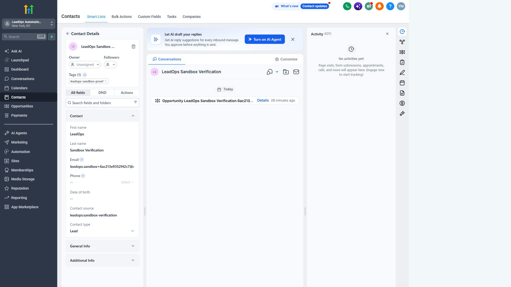
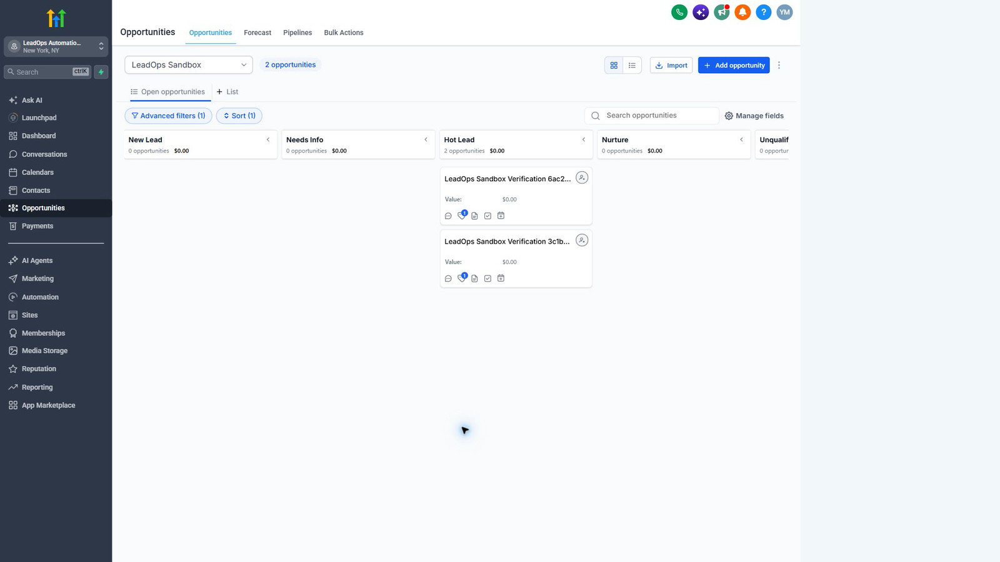
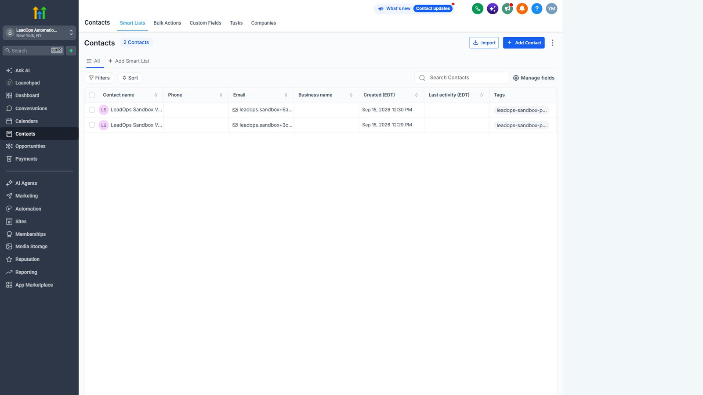
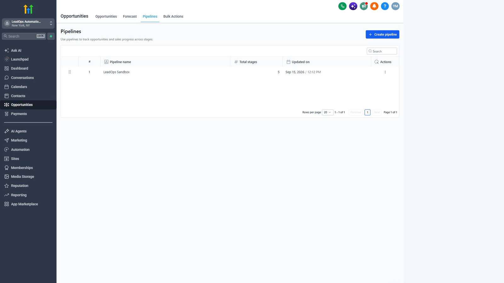

# Official HighLevel Sandbox evidence

This page records a controlled verification against an official HighLevel
Sandbox on 2026-09-16. The records shown below are synthetic test data. No
customer contact, message, appointment, or payment was involved.

## What the live run proves

- the Private Integration token authenticated against the current `v3` API;
- the selected pipeline and stage belong to the Sandbox location;
- sending the same contact payload twice returns one stable contact ID;
- a second opportunity pass reuses the existing open opportunity;
- a newly created opportunity may take a few seconds to appear in search, so
  the verifier waits for index convergence without creating another record;
- the verifier calls no messaging, appointment, or payment endpoint.

The [machine-readable result](evidence/ghl-sandbox-verification.json) contains
only timestamps, counts, booleans, API version, and irreversible ID
fingerprints.

For a compact overview, watch the
[90-second captioned walkthrough](video/ghl-sandbox-walkthrough.mp4). It has no
voice-over, so it can be reviewed without audio. The committed video is
reproducible from these screenshots and the editable subtitle file:

```bash
python scripts/build_sandbox_video.py
```

## Contact created by the integration



The UI identifies the creator as `INTEGRATION`, shows the reserved
`leadops-sandbox-proof` tag and `leadops:sandbox-verification` source, and links
the contact to the zero-value test opportunity. The displayed `example.com`
address is reserved synthetic data.

## Opportunity routed to the configured stage



Two cards appear because the verifier was executed in two separate runs with
different synthetic markers. Within each run, the same contact payload was sent
twice and produced one contact and one open opportunity. This distinction is
important: the claim is repeatability within a lead identity, not that every
test run shares one identity.

## Contact inventory



The Sandbox contains only the two generated verification contacts. Both have
the expected tag and no phone number or real customer data.

## Pipeline inventory



The dedicated `LeadOps Sandbox` pipeline has five stages. The verification
command first confirms the configured pipeline and stage are returned by the
same location before any write is allowed.

## Boundary of the evidence

This is genuine Sandbox evidence, not a production-deployment claim. It does
not prove paid-account configuration, production rate limits, SMS/email sender
setup, appointment calendars, payments, or business outcomes. Those checks
belong in a controlled client onboarding stage.
